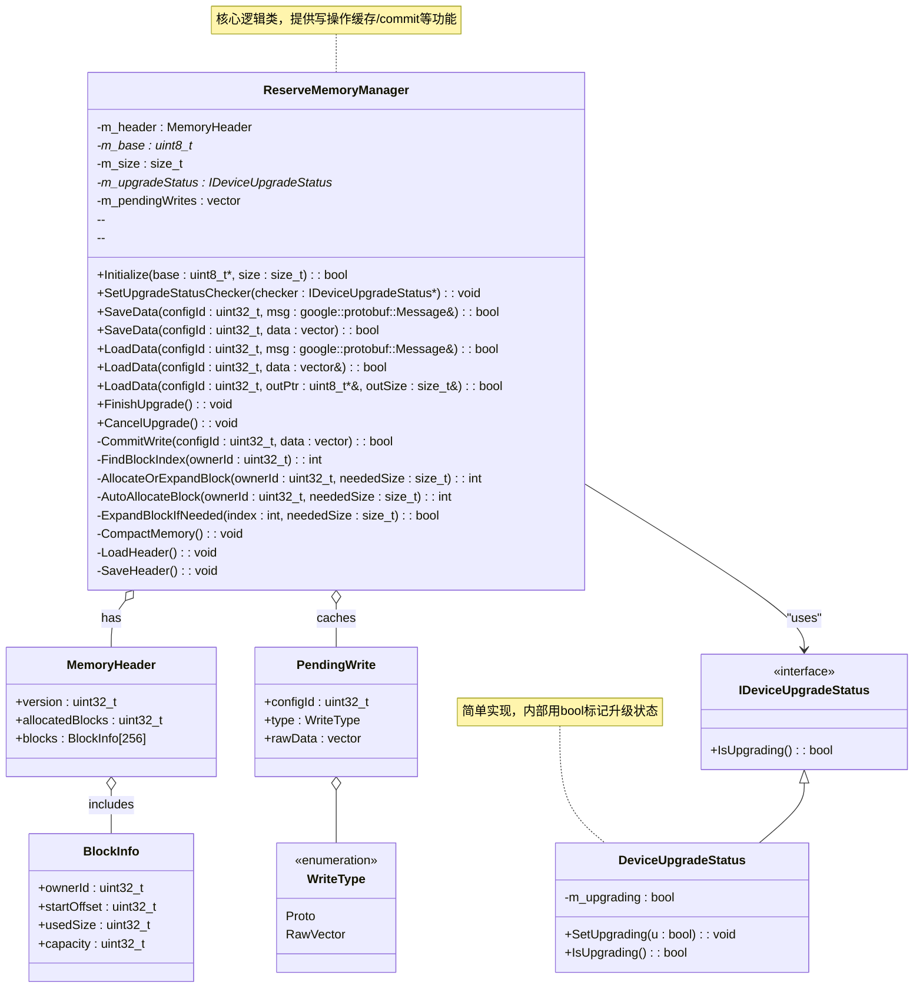
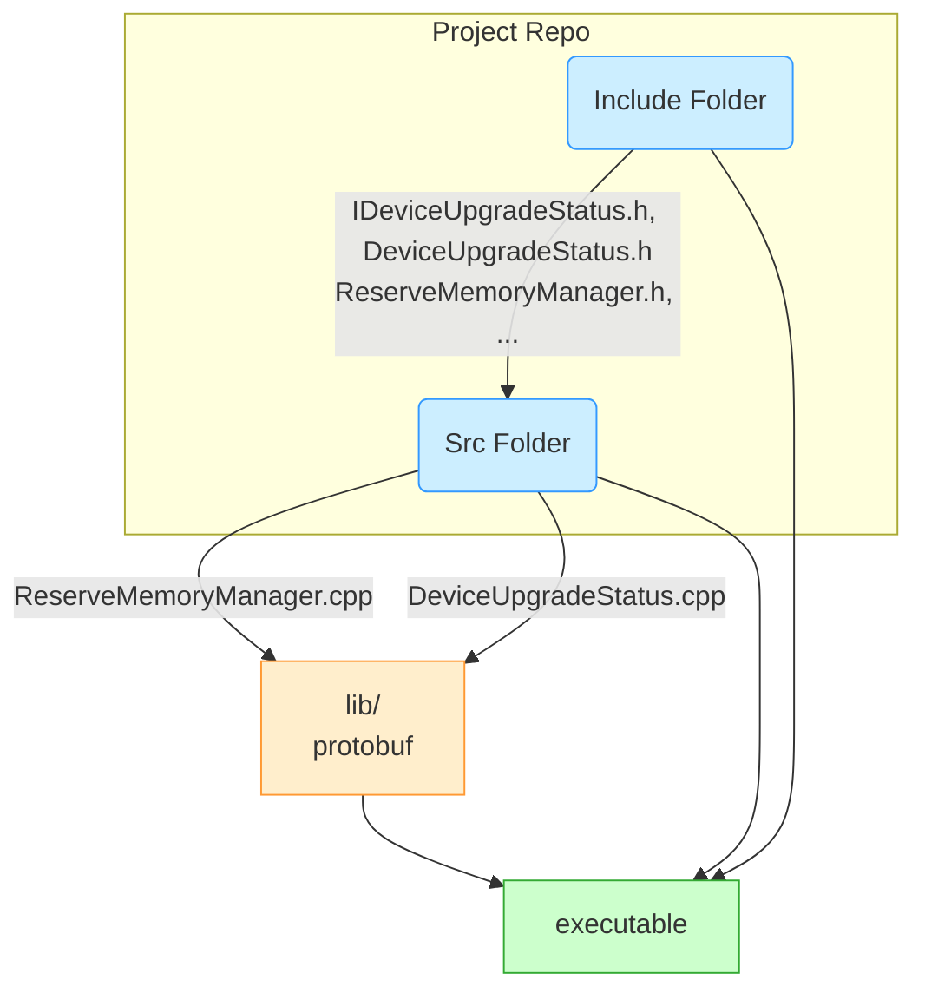
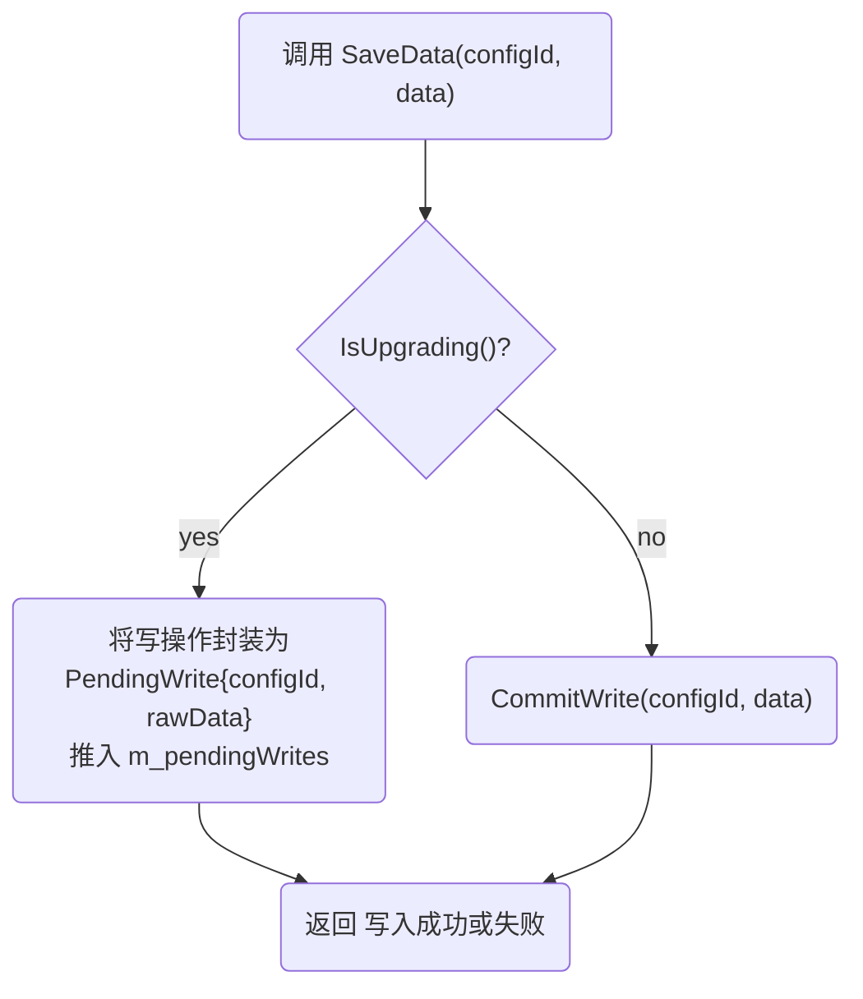
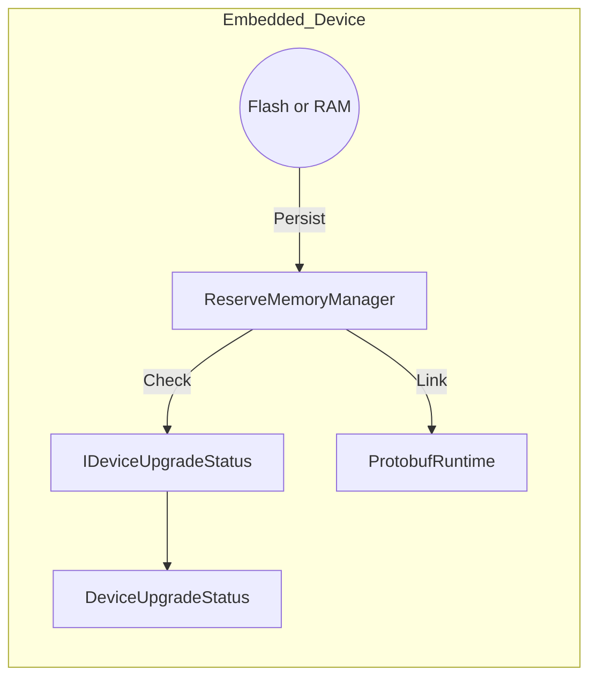
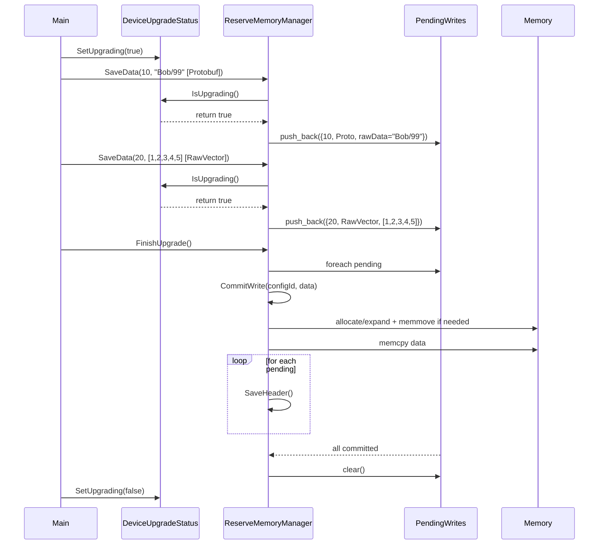

# 1. Logical View（逻辑视图）

逻辑要点：
	•	IDeviceUpgradeStatus：定义 IsUpgrading() 接口；
	•	DeviceUpgradeStatus：实现上述接口，并提供 SetUpgrading(bool)；
	•	ReserveMemoryManager：是核心，持有一个 IDeviceUpgradeStatus* 用于判断是否升级中；在写操作时如升级中则缓存到 m_pendingWrites，否则直接CommitWrite。
	•	MemoryHeader / BlockInfo：存储在保留内存起始，用于记录各个块分配信息；
	•	PendingWrite：缓存的写操作（Protobuf 序列化后或原始向量），区分类型（Proto / RawVector）。

# 2. Development View（开发视图）

开发视图侧重项目的代码组织、包/模块划分，以及如何在工程结构中分配各类、接口、库的依赖等。可以用 UML 包图 或 组件图 表示。

	•	include/headers：存放 .h 文件，如 IDeviceUpgradeStatus.h, DeviceUpgradeStatus.h, ReserveMemoryManager.h。
	•	core/logic：存放 .cpp 文件，如 ReserveMemoryManager.cpp, DeviceUpgradeStatus.cpp。
	•	依赖**protobuf** 库进行序列化/反序列化；
	•	编译后生成 executable 或静态/动态库。

# 3. Process View（过程视图）

过程视图重点关注系统运行时的并发、线程、交互流程等。由于我们示例工程主要是单线程演示，可以用活动图或顺序图说明写操作或升级流程。

这里给出一个活动图，示例展示 “SaveData 被调用时” 的决策与操作流程：

## 3.1 UML 活动图：SaveData 调用流程

	•	IsUpgrading()：由 ReserveMemoryManager::m_upgradeStatus 提供
	•	如果是升级中，则缓存到 m_pendingWrites；否则直接调用 CommitWrite（进行分配/扩容/写入）。

线程或并发
	•	如果系统需要多线程并发访问 ReserveMemoryManager，需在入口（SaveData(), FinishUpgrade(), CancelUpgrade(), LoadData()等）或内部加锁（互斥）。
	•	本示例未体现多线程，可在此视图中标注 “此处需加全局互斥锁” 或 “此处需使用读写锁” 等细节。

# 4. Physical View（物理视图）

# 5. Scenarios（场景视图）
